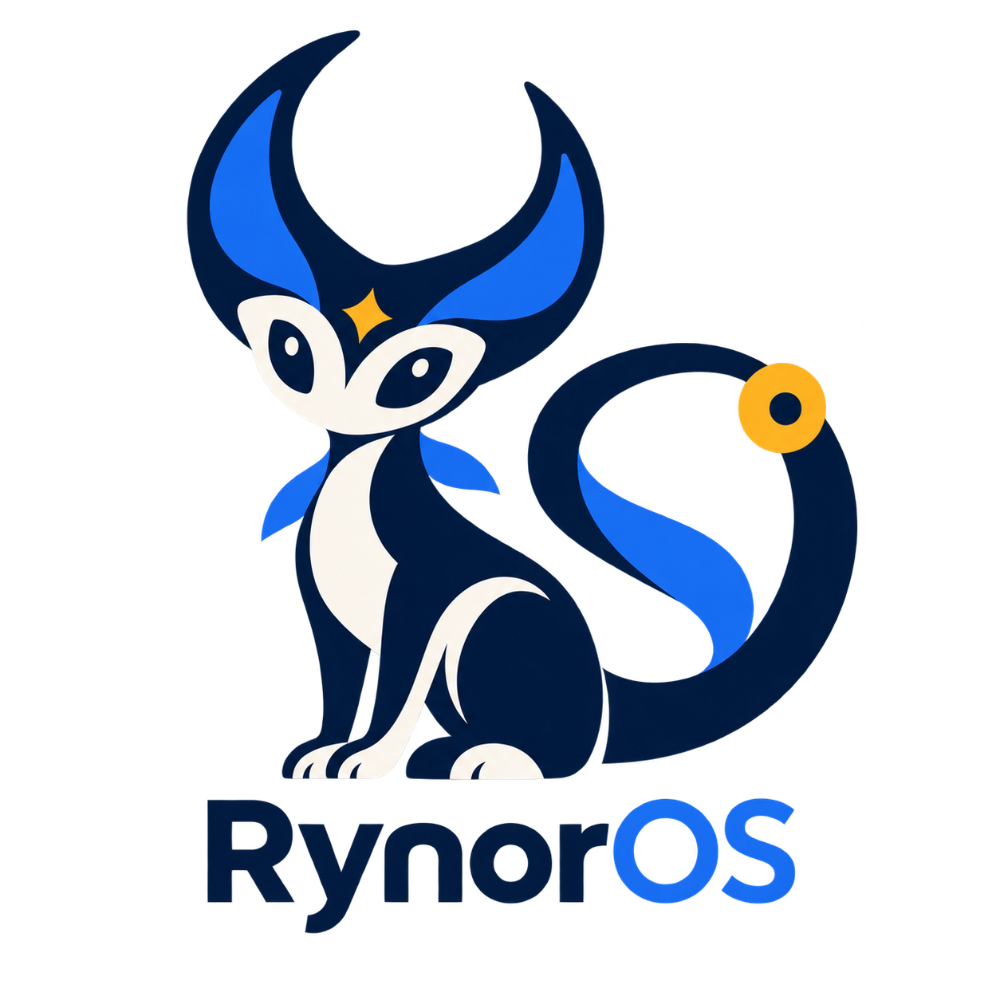

<h1> RynorOS</h1>

An original operating-system project: **Rynorkernel**, with **RynorLang** (`.rl`)
planned as its native language — a statically typed shell and scripting
language (interactive REPL, scripts, structured `|>` pipelines over typed
values) filling a PowerShell-like *role* with an original design, not a clone.
Inspired by the simplicity of TempleOS, not based
on its implementation, Linux, BSD, or an existing userspace.

## Current state — Stage 16 host-native programs (verified, host-side)

This is a single-CPU kernel development platform plus a **host-side RynorLang toolchain through native programs**, **not a usable or
production-ready OS**. The independently [audited Stage 7 scheduler](docs/reports/stage7-audit.md)
(repair, ownership and limits), the [Stage 8 keyboard](docs/reports/stage8-audit.md),
and the [Stage 9 display](docs/reports/stage9-audit.md) are the prior verified
milestones. Stage 10 adds bounded strings/byte buffers and ring-0 runtime
services driven from real worker threads; see [docs/reports/stage10-audit.md](docs/reports/stage10-audit.md)
and [docs/design/runtime.md](docs/design/runtime.md). Stage 11 adds a verified
ring-0 kernel monitor (`kernel/shell/`) with real `IRQ1` input; see
[docs/reports/stage11.md](docs/reports/stage11.md) and [docs/design/shell.md](docs/design/shell.md). **Stage 12 freezes the RynorLang lexical subset** and provides one host-side `tools/rynorlang/lex.py` implementation with precise spans, first-error diagnostics, and deterministic output; see [docs/reports/stage12.md](docs/reports/stage12.md) and [docs/design/rynorlang-lexer.md](docs/design/rynorlang-lexer.md). **Stage 13 parses that token stream** into a documented temporary syntax tree with exact spans, precedence, associativity, dangling-else, and depth-bounded diagnostics; see [docs/reports/stage13.md](docs/reports/stage13.md) and [docs/design/rynorlang-parser.md](docs/design/rynorlang-parser.md). **Stage 14 lowers that tree** into a stable JSON-compatible AST and performs name resolution and type checking with exact `SEM_*` diagnostics; see [docs/reports/stage14.md](docs/reports/stage14.md) and [docs/design/rynorlang-ast.md](docs/design/rynorlang-ast.md). **Stage 15a adds a typed IR, verifier, and native backend** with real dominance and a SysV-subset ABI; see [docs/reports/stage15a.md](docs/reports/stage15a.md). **Stage 15b adds an edition-gated shell surface** (`|>` pipelines, commands); see [docs/reports/stage15b.md](docs/reports/stage15b.md). **Stage 16 turns verified sources into real host-native ELF programs** with exact-bytes `print`; see [docs/reports/stage16.md](docs/reports/stage16.md). The [roadmap](ROADMAP.md) stages 0–16 as implemented milestones (not production readiness); Stage 17 onward remains planned.

Implemented and exercised in QEMU:

- Original BIOS/SeaBIOS boot, x86-64 entry, COM1 serial, kernel GDT/IDT and real
  exception diagnostics.
- PIC/PIT IRQs, real E820 memory discovery, 4096-byte physical-frame allocation.
- PMM-owned four-level paging, mapping/unmapping/translation, RO/NX enforcement,
  real page faults and TLB invalidation.
- A fixed 64 KiB kernel heap.
- Seven worker slots plus bootstrap; four-page RW/NX stacks with an **unmapped,
  unbacked** guard; owned stack teardown and non-reused thread IDs.
- Round-robin timer preemption, cooperative yield, exit and nonblocking join/reap.
  Interrupt-state preservation and single-CPU lock contracts.
- PS/2 keyboard on i8042/IRQ1: a 31-sample drop-newest queue, explicit loss
  reporting, and a documented Set-1 subset. Host-selected QEMU keys are checked
  against actual events and independent device/IRQ/data-port traces.
- Validated QEMU standard-VGA PCI/BGA handoff, uncached RW/NX framebuffer,
  bounds-safe pixels/rectangles and a bounded uppercase/digit text subset.
  Complete framebuffer bytes and actual QEMU scanout are independently checked.
- Bounded strings/byte rings and three allocation-free ring-0 runtime services.
  Worker results, physical state and QEMU CPU IRQ traces are cross-checked;
  services reject IRQ calls and require valid, caller-owned objects.
 - Host-side RynorLang lexer (`tools/rynorlang/lex.py`): ASCII and 1 MiB bounded; `//` comments; exact `fn`/`let`/`if`/`else`/`while`/`return`/`true`/`false`/`int`/`bool`/`str` keywords; `[A-Za-z_][A-Za-z0-9_]*` identifiers; bounded decimal integers; `\\`, `\"`, `\n`, and `\t` string escapes; maximal-munch operators including standalone `!`; exact spans; and first-error diagnostics. Lexical errors exit 1. The strict suite has 49 lexer tests.
- Host-side RynorLang parser (`tools/rynorlang/parse.py`): consumes the Stage 12 token stream into a frozen temporary syntax tree with exact spans, colon return types, no trailing list commas, left-associative precedence (`||` < `&&` < `==`/`!=` < `<`/`>`/`<=`/`>=` < `+`/`-` < `*`/`/`/`%` < unary), nearest-`if` else binding, and bounded nesting (depth 256 → `PAR_DEPTH_EXCEEDED`). It rejects malformed input with located `PAR_*` diagnostics. The strict suite has 54 parser tests, including exact call-nesting and wide-flat-tree CLI regressions.
 - Host-side RynorLang semantics (`tools/rynorlang/analyze.py`): lowers the temporary tree into a stable JSON-compatible AST (`Program, Function, Param, Block, Let, If, While, Return, ExprStmt, BinOp, UnOp, IntLit, BoolLit, StrLit, Var, Call`) with exact spans, deterministic symbol indices, and type checking (no implicit conversions, `unit` for missing return, `str` equality vs ordering, `!`/`-` unary, `&&`/`||` bool, call arity, etc.). No shadowing, forward function references allowed, locals block-scoped. The strict suite has 63 semantics tests with 12 valid and 20 invalid fixtures plus an 8-test public-API gauntlet; no interpretation, codegen, or execution is claimed.

There is no user mode, process address-space switching, scheduler sleep/wake,
filesystem, GUI/desktop, networking, or RynorLang execution beyond the stable semantic AST.
The language examples cannot execute; `print` is still `SEM_UNKNOWN_FUNCTION`. No SMP, SIMD thread context, COW,
swap, demand paging or new large-page support exists. The shell is a
`Ring 0` trusted monitor, not protected userspace (`Stage 18a`).

## What the image actually does

Boot preserves its original regression prefix:

```text
Rynorkernel booted.
RynorOS 0.1.0 | x86_64 | stage1
```

It verifies CPU descriptors and breakpoint return, discovers/tests physical RAM,
replaces boot paging, tests permissions/faults, and tests the heap. Three PIT
heartbeat IRQs and the scheduler tests precede the Stage 8 banner:

```text
[SYSTEM] RynorOS 0.1.0 | Rynorkernel | stage8 hardware input
```

The scheduler tests exercise resource failure/rollback, lifecycle and locks,
then non-yielding workers under real timer interrupts. Four-, two- and
one-runnable-context cases are checked. Stage 8 configures the i8042 and keyboard,
reports eight host-selected keys (16 raw bytes, zero drops), and exercises IRQ1
while IRQ0 schedules another worker. Stage 9 validates its boot-time display
handoff, exercises MMIO rollback and guarded drawing/text tests, then paints a
1024x768 pattern/font atlas. Stage 10 runs bounded string/buffer/service
self-tests and drives the runtime services from seven worker threads before the
final PMM/VM/heap/scheduler integrity check passes (keyboard, display, timer and
runtime each verify their own accounting inside their own phase) and the
bootstrap context halts with interrupts masked.
This is an explicit bounded test boot, not an interactive session or uptime service.

PIT configuration is 1193182/11932 Hz (about 99.99849 Hz); serviced IRQs are not
a wall-clock guarantee. Final retained memory in the normal display configuration
is fourteen page-table frames plus sixteen heap frames: 122880 allocated bytes.
The extra four table pages map foreign device VRAM, not PMM RAM. Worker stack frames and their
temporary table branch are reclaimed after join.

## Build and verify

Host requirements: Python 3.10+ standard library, NASM, Clang, LLD, and QEMU
with SeaBIOS. No WSL, host libc, third-party kernel/loader, Make or ISO utility.
See [dependency setup](docs/design/bootstrap-dependencies.md) for paths and versions.

```text
python tools/build/build.py validate
python tools/build/build.py build
python tools/build/build.py boot-test
python tools/build/build.py test
python tools/build/build.py integration-test
python tools/build/build.py check
```

`validate` checks metadata/assets/structure, not CPU execution. `build` compiles
and links original guest code, creates the 1 MiB raw boot image and packages
resources separately. `test` runs repository/parser/build-failure checks.
`boot-test` builds and captures actual serial output with a default 10-second
guest-completion deadline (`--timeout` can override it); completed boots may
receive up to five more seconds for physical evidence capture. `integration-test` includes normal and
deliberately broken images, hardware faults, RAM-layout variations, ELF state
comparisons and byte-identical rebuilds. `check` runs build and both suites.

Artifacts under ignored `build/`: `boot.bin`, `rynorkernel.bin`,
`rynorkernel.elf`, `rynoros.img`, `rynoros-resources.zip` and
`build-manifest.json`. Logs include serial transcripts and owned-QEMU cleanup
records. The reviewed inventory contains 477 repository and 162 integration test
methods. The build command checks exact per-module participation before discovery. Exact commands and evidence are in the
[forensic stabilization report](docs/reports/forensic-stabilization-final.md), [Stage 16 report](docs/reports/stage16.md), [Stage 15b report](docs/reports/stage15b.md), [Stage 15a report](docs/reports/stage15a.md), [Stage 14 report](docs/reports/stage14.md), [Stage 13 report](docs/reports/stage13.md) and [Stage 10 independent audit](docs/reports/stage10-audit.md); test counts alone are not correctness.
Display evidence is retained as `display.pmem` and `display.ppm` beside each
successful normal boot's serial log; this is emulator, not physical-hardware evidence.
Runtime execution evidence is `runtime.pmem` plus CPU interrupt records in
`guest-errors.log`. Shell evidence is per-key `scan`/`ascii`/`line` and per-command `exec`/`result` in the serial log, plus QEMU `sendkey`/`pic_interrupt` trace for the `39`-key session.

All evidence lives only in the git-ignored `build/` tree; a clean checkout
contains no runtime evidence and must regenerate it with the pinned tools.
Full verification expectations: `integration-test`/`check` take roughly
approximately 18-20 minutes on the reference host and run QEMU under TCG with the translation
cache bounded to 32 MiB per emulator (see
[Stage 10 audit](docs/reports/stage10-audit.md) timing records).

## Identity and layout

The header uses the established [official icon](assets/branding/icon.png).
Its original PNG is preserved in the [asset hierarchy](assets/README.md) and
packaged deterministically, never embedded in the boot image. The serial runtime
uses the same OS/kernel names and reports its real stage. **No guest renders the
icon**; PNG decoding and graphical UI remain future work. The framebuffer test
uses the same OS identity in text, not an invented icon conversion.

| Path | Responsibility |
| --- | --- |
| `boot/` | Original BIOS loader, E820 handoff, long-mode transition |
| `kernel/` | CPU/IRQs, PMM/VM/heap, stacks and kernel execution |
| `assets/` | Canonical identity resource, packaged separately |
| `tools/`, `tests/` | Host builds and explicit repository/hardware verification |
| `rynorlang/`, `tools/rynorlang/`, `user/` | Language docs/reserved native tree, implemented host lexer/parser/semantics, and future userspace |
| `docs/design/`, `docs/reports/` | Contracts, limitations and audit evidence |

Start with [architecture](ARCHITECTURE.md), [roadmap](ROADMAP.md),
[contributing](CONTRIBUTING.md), and [project metadata](project.json)
(Stage 14/schema 14). Implemented means present and verified under stated
conditions; planned/experimental does not mean executable.

## Windows Compatibility Program — planned (21a–21m)

After the native foundation (Stages 0–20, self-hosting), RynorOS will host a
Windows-compatible execution environment **under Rynorkernel** — not as a
replacement for it. See [ROADMAP](ROADMAP.md) (21a–21m) and
[Windows compatibility design](docs/design/windows-compatibility.md).

Conceptually:

```text
CPU / hardware
      │
      ▼
┌───────────────────────┐
│      Rynorkernel      │  owns CR3/IDT/GDT/TSS/PMM/VM/devices
└──────────┬────────────┘
           │  isolation / virtualization boundary
           ▼
┌─────────────────────────────┐
│ Windows Compatibility Layer │  Win32/NT semantics, PE loader, handles,
│                             │ sync, virtual devices, DXGI/D3D translation
└─────────────┬───────────────┘
              ├──────────┬──────────┐
              ▼          ▼          ▼
        Windows apps  Windows games  (certified per matrix)
```

The program is staged `21a PE format → 21b ABI → 21c Win32 → 21d GUI → 21e graphics → 21f audio/input → 21g loader/DLL → 21h runtime → 21i game harness → 21j network → 21k driver containment → 21l advanced games → 21m certification`, with an explicit **security/anti-cheat classification** `A–E` (no bypass: `A` pure user-mode, `B` runtime deps, `C` kernel-driver semantics, `D` vendor-approved attestation, `E` unsupported). Rynorkernel is not “a ring above ring 0” — the boundary is `CPL0/CPL3 + U/S paging` (and optionally `VMX Root/Non-Root + EPT/IOMMU`). Every stage requires protected userspace (18a), storage (17a/b) and the graphics stack; no game is *supported* until it passes the certification framework. See the design doc for bare-metal (`VT-x/SVM, IOMMU, APIC, PCIe, GPU`) and testing requirements.
