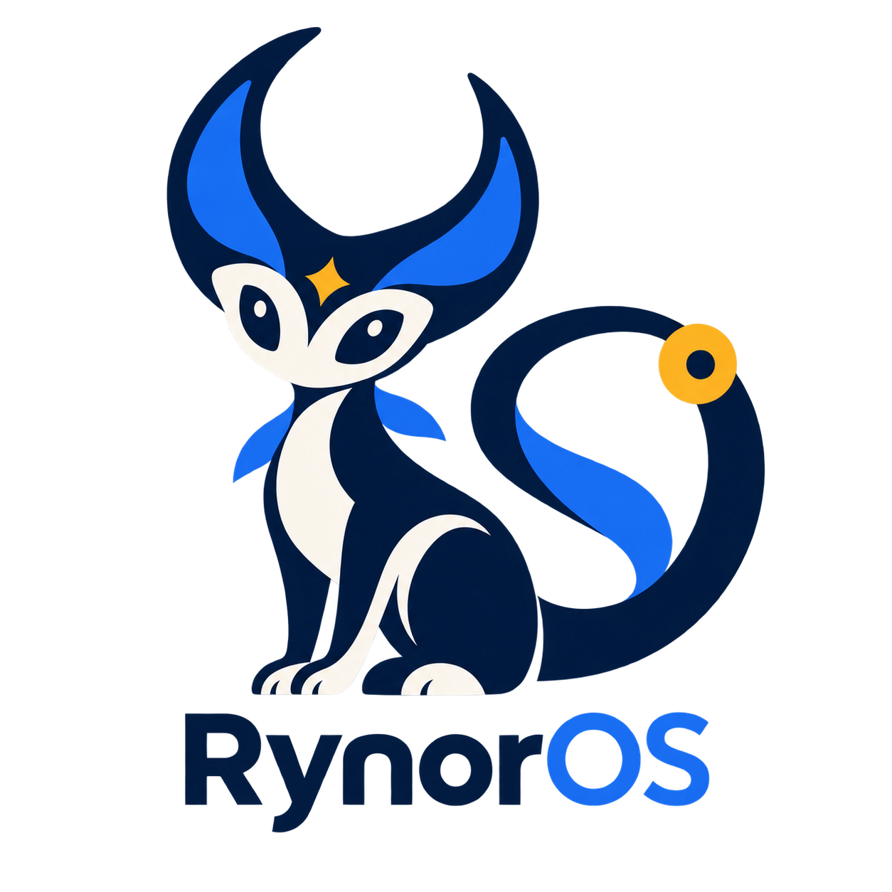

<h1> RynorOS</h1>

An original operating-system project: **Rynorkernel**, with **RynorLang** (`.rl`)
as its native language — a statically typed shell and scripting
language (interactive REPL, scripts, structured `|>` pipelines over typed
values) filling a PowerShell-like *role* with an original design, not a clone.
The host toolchain runs through native programs and self-host emission, and a
bounded RynorLang evaluator runs in-OS. Inspired by the simplicity of
TempleOS, not based on its implementation, Linux, BSD, or an existing
userspace.

## Current state — INT-A2 PCI MSI/MSI-X delivery (verified within limits, QEMU TCG)

This is a single-CPU kernel development platform plus a **host-side RynorLang toolchain through native programs**, **not a usable or
production-ready OS**. The independently [audited Stage 7 scheduler](docs/reports/stage7-audit.md)
(repair, ownership and limits), the [Stage 8 keyboard](docs/reports/stage8-audit.md),
and the [Stage 9 display](docs/reports/stage9-audit.md) are the prior verified
milestones. Stage 10 adds bounded strings/byte buffers and ring-0 runtime
services driven from real worker threads; see [docs/reports/stage10-audit.md](docs/reports/stage10-audit.md)
and [docs/design/runtime.md](docs/design/runtime.md). Stage 11 adds a verified
ring-0 kernel monitor (`kernel/shell/`) with real `IRQ1` input; see
[docs/reports/stage11.md](docs/reports/stage11.md) and [docs/design/shell.md](docs/design/shell.md). **Stage 12 freezes the RynorLang lexical subset** and provides one host-side `tools/rynorlang/lex.py` implementation with precise spans, first-error diagnostics, and deterministic output; see [docs/reports/stage12.md](docs/reports/stage12.md) and [docs/design/rynorlang-lexer.md](docs/design/rynorlang-lexer.md). **Stage 13 parses that token stream** into a documented temporary syntax tree with exact spans, precedence, associativity, dangling-else, and depth-bounded diagnostics; see [docs/reports/stage13.md](docs/reports/stage13.md) and [docs/design/rynorlang-parser.md](docs/design/rynorlang-parser.md). **Stage 14 lowers that tree** into a stable JSON-compatible AST and performs name resolution and type checking with exact `SEM_*` diagnostics; see [docs/reports/stage14.md](docs/reports/stage14.md) and [docs/design/rynorlang-ast.md](docs/design/rynorlang-ast.md). **Stage 15a adds a typed IR, verifier, and native backend** with real dominance and a SysV-subset ABI; see [docs/reports/stage15a.md](docs/reports/stage15a.md). **Stage 15b adds an edition-gated shell surface** (`|>` pipelines, commands); see [docs/reports/stage15b.md](docs/reports/stage15b.md). **Stage 16 turns verified sources into real host-native ELF programs**
with exact-bytes `print`; see [docs/reports/stage16.md](docs/reports/stage16.md). **Stage 17a adds IDE block storage** (PIO discovery, reads, test-device writes, host-recomputed digests); see [docs/reports/stage17a.md](docs/reports/stage17a.md). **Stage 17b adds a read-only native filesystem** (versioned format, validated metadata, path lookup, cross-block reads, corruption rejection); see [docs/reports/stage17b.md](docs/reports/stage17b.md). **Stage 17c adds overwrite-in-extent writes** (explicit partial-write reporting, torn-data-possible/metadata-always-valid, armed fault injection, remount readback); see [docs/reports/stage17c.md](docs/reports/stage17c.md). **Stage 18a adds a static protected-userspace foundation** (CPL3 entry, isolated address spaces, exit/yield gate, fault kills, timer preemption); see [docs/reports/stage18a.md](docs/reports/stage18a.md) and [docs/design/userspace.md](docs/design/userspace.md). **Stage 18b adds executable loading and syscalls** (RYNX envelopes from RYNORFS, fixed code/data/stack reuse, `int $0x80` exit/write/yield, validated copyin, real compiled programs in CPL3); see [docs/reports/stage18b.md](docs/reports/stage18b.md), [docs/design/executable-format.md](docs/design/executable-format.md) and [docs/design/syscall-abi.md](docs/design/syscall-abi.md). **Stage 18c adds a native runtime library in CPL3** (validated exit/write/yield wrappers, transactional formatting, bounded arena, cooperative sync, honest `RT_NOSYS` stubs; RynorLang print rebinds to the library for in-OS targets); see [docs/design/native-runtime.md](docs/design/native-runtime.md). **Stage 18d adds a native shell and REPL in CPL3** (syscalls 3–8, processes/pipes, filesystem scripts, streaming pipelines with backpressure, bounded resident evaluator with transactional commits plus `len(expr)`); see [docs/reports/stage18d.md](docs/reports/stage18d.md) and [docs/design/stage18d-abi.md](docs/design/stage18d-abi.md). **Stages 19a–19d grow the language** (aggregates, match/control, modules, conformance); see [docs/reports/stage19a.md](docs/reports/stage19a.md) through [docs/reports/stage19d.md](docs/reports/stage19d.md). **Stage 19e closes RynorLang feature development** (M8 string returns, compiler freeze; full self-host scaling deferred); see [docs/reports/stage19e.md](docs/reports/stage19e.md). **P1-A1/A2/A3 add durable userspace files** (create/write/stat/enumerate/unlink via syscalls 9–13). **PCI-A1 adds PCI discovery with BAR mapping**; see [docs/design/pci.md](docs/design/pci.md). **DMA-A1 adds DMA buffers** over contiguous PMM frames; see [docs/design/dma.md](docs/design/dma.md). **BOOT-A1 removes the load ceiling** (8 MiB high-load kernel); see [docs/design/boot.md](docs/design/boot.md). **INT-A1 adds ACPI/APIC interrupts** (RSDP/MADT discovery, LAPIC/IOAPIC, unified IRQ core, PIC fallback); see [docs/design/acpi-apic.md](docs/design/acpi-apic.md). **INT-A2 adds PCI MSI/MSI-X delivery** (capability walk, single/multi-vector messages, live edu/xHCI/e1000e proofs); see [docs/design/msi.md](docs/design/msi.md). The [roadmap](ROADMAP.md) stages 0–19e plus the P1/PCI/DMA/BOOT/INT tracks as implemented milestones (not production readiness).

Implemented and exercised in QEMU:

- Original BIOS/SeaBIOS boot with BOOT-A1 high loading (4 KiB boot part, 8 MiB
  file / 16 MiB memory kernel caps), x86-64 entry, COM1 serial, kernel GDT/IDT
  and real exception diagnostics.
- ACPI RSDP/MADT discovery, LAPIC/IOAPIC with a unified IRQ core (vectors
  32–127, 255 spurious), PCI MSI/MSI-X delivery over vectors 48–127 with live
  device proofs, PIC/PIT retained as the verified fallback, real E820
  memory discovery, 4096-byte physical-frame allocation.
- PCI discovery with BAR sizing/mapping, and DMA buffers over physically
  contiguous PMM frames (no IOMMU; `bus == phys`).
- Durable userspace files: create/write/stat/enumerate/unlink via syscalls
  9–13, plus processes, pipes, and the CPL3 native shell with scripts and a
  bounded resident evaluator.
- PMM-owned four-level paging, mapping/unmapping/translation, RO/NX enforcement,
  real page faults and TLB invalidation.
- A fixed 64 KiB kernel heap.
- Seven worker slots plus bootstrap; four-page RW/NX stacks with an **unmapped,
  unbacked** guard; owned stack teardown and non-reused thread IDs.
- Round-robin timer preemption, cooperative yield, exit and nonblocking join/reap.
  Interrupt-state preservation and single-CPU lock contracts.
- PS/2 keyboard on i8042/IRQ1: a 31-sample drop-newest queue, explicit loss
  reporting, and a documented Set-1 subset. Host-selected QEMU keys are checked
  against actual events and independent device/IRQ/data-port traces.
- Validated QEMU standard-VGA PCI/BGA handoff, uncached RW/NX framebuffer,
  bounds-safe pixels/rectangles and a bounded uppercase/digit text subset.
  Complete framebuffer bytes and actual QEMU scanout are independently checked.
- Bounded strings/byte rings and three allocation-free ring-0 runtime services.
  Worker results, physical state and QEMU CPU IRQ traces are cross-checked;
  services reject IRQ calls and require valid, caller-owned objects.
 - Host-side RynorLang lexer (`tools/rynorlang/lex.py`): ASCII and 1 MiB bounded; `//` comments; exact `fn`/`let`/`if`/`else`/`while`/`return`/`true`/`false`/`int`/`bool`/`str` keywords; `[A-Za-z_][A-Za-z0-9_]*` identifiers; bounded decimal integers; `\\`, `\"`, `\n`, and `\t` string escapes; maximal-munch operators including standalone `!`; exact spans; and first-error diagnostics. Lexical errors exit 1. The strict suite has 49 lexer tests.
- Host-side RynorLang parser (`tools/rynorlang/parse.py`): consumes the Stage 12 token stream into a frozen temporary syntax tree with exact spans, colon return types, no trailing list commas, left-associative precedence (`||` < `&&` < `==`/`!=` < `<`/`>`/`<=`/`>=` < `+`/`-` < `*`/`/`/`%` < unary), nearest-`if` else binding, and bounded nesting (depth 256 → `PAR_DEPTH_EXCEEDED`). It rejects malformed input with located `PAR_*` diagnostics. The strict suite has 55 parser tests, including exact call-nesting and wide-flat-tree CLI regressions.
 - Host-side RynorLang semantics (`tools/rynorlang/analyze.py`): lowers the temporary tree into a stable JSON-compatible AST (`Program, Function, Param, Block, Let, If, While, Return, ExprStmt, BinOp, UnOp, IntLit, BoolLit, StrLit, Var, Call`) with exact spans, deterministic symbol indices, and type checking (no implicit conversions, `unit` for missing return, `str` equality vs ordering, `!`/`-` unary, `&&`/`||` bool, call arity, etc.). No shadowing, forward function references allowed, locals block-scoped. The strict suite has 63 semantics tests with 12 valid and 20 invalid fixtures plus an 8-test public-API gauntlet; no interpretation, codegen, or execution is claimed.

There is no demand paging, GUI/desktop, networking, or SMP/SIMD thread context.
A subset of host-native sources rebuilds as RYNX and runs as RynorOS
userspace programs through the Stage 18b loader (fixed code/data/stack
windows, ≤4 KiB segments, no argv/env, frozen syscalls, files via
RYNORFS images); Linux ELFs never load directly.
No COW, swap or new large-page support exists. The `Ring 0` trusted monitor
stays frozen with no evaluation; the native shell (Stage 18d: REPL, scripts,
pipelines, resident evaluator) runs in CPL3 alongside compiled programs.
`rt_wait_flag`/`rt_nap` are caller-bounded cooperative yields only (no kernel
sleep/wait-queue); an unbounded `max_yields` can starve the single CPU by
design. RynorLang feature development is closed (Stage 19e M8); full compiler
self-hosting remains deferred.

## What the image actually does

Boot preserves its original regression prefix:

```text
Rynorkernel booted.
RynorOS 0.1.0 | x86_64 | stage1
```

It verifies CPU descriptors and breakpoint return, discovers/tests physical RAM,
replaces boot paging, tests permissions/faults, and tests the heap. Three PIT
heartbeat IRQs and the scheduler tests precede the Stage 8 banner:

```text
[SYSTEM] RynorOS 0.1.0 | Rynorkernel | stage8 hardware input
```

The scheduler tests exercise resource failure/rollback, lifecycle and locks,
then non-yielding workers under real timer interrupts. Four-, two- and
one-runnable-context cases are checked. Stage 8 configures the i8042 and keyboard,
reports eight host-selected keys (16 raw bytes, zero drops), and exercises IRQ1
while IRQ0 schedules another worker. Stage 9 validates its boot-time display
handoff, exercises MMIO rollback and guarded drawing/text tests, then paints a
1024x768 pattern/font atlas. Stage 10 runs bounded string/buffer/service
self-tests and drives the runtime services from seven worker threads. Later
phases verify PCI discovery, ACPI/APIC interrupt bring-up (with the PIT and
keyboard proofs re-run through the IOAPIC), the ring-0 shell session, and the
userspace/load/runtime/proc/pipe/filesystem/storage lifecycle before the final
accounting check passes (each phase verifies its own accounting inside its own
phase) and the bootstrap context halts with interrupts masked.
This is an explicit bounded test boot, not an interactive session or uptime service.

PIT configuration is 1193182/11932 Hz (about 99.99849 Hz); serviced IRQs are not
a wall-clock guarantee. Final retained memory in the normal display configuration
is sixteen page-table frames plus sixteen heap frames: 131072 allocated bytes
(the APIC window adds one frame plus one table over the pre-INT-A1 126976).
The extra four table pages map foreign device VRAM, not PMM RAM. Worker stack frames and their
temporary table branch are reclaimed after join.

## Build and verify

Host requirements: Python 3.10+ standard library, NASM, Clang, LLD, and QEMU
with SeaBIOS. No host libc, third-party kernel/loader, Make or ISO utility for the
kernel/QEMU path (no WSL needed there); the RynorLang native program pipeline
additionally needs an ELF runner (POSIX host or WSL archlinux).
See [dependency setup](docs/design/bootstrap-dependencies.md) for paths and versions.

```text
python tools/build/build.py validate
python tools/build/build.py build
python tools/build/build.py boot-test
python tools/build/build.py test
python tools/build/build.py integration-test
python tools/build/build.py check
```

`validate` checks metadata/assets/structure, not CPU execution. `build` compiles
and links original guest code, creates the minimum-1 MiB raw boot image (it
grows past 1 MiB for large kernels) and packages
resources separately. `test` runs repository/parser/build-failure checks.
`boot-test` builds and captures actual serial output with a default 10-second
guest-completion deadline (`--timeout` can override it); completed boots may
receive up to five more seconds for physical evidence capture. `integration-test` includes normal and
deliberately broken images, hardware faults, RAM-layout variations, ELF state
comparisons and byte-identical rebuilds. `check` runs build and both suites.

Artifacts under ignored `build/`: `boot.bin`, `rynorkernel.bin`,
`rynorkernel.elf`, `rynoros.img`, `rynoros-resources.zip` and
`build-manifest.json`. Logs include serial transcripts and owned-QEMU cleanup
records. The reviewed inventory contains 1127 repository and 505 integration test
methods (Stage 18d Slices A/B: input path + syscall substrate; Slice C: processes + loader; Slice D: files + pipes; Slice E: CPL3 shell + scripts; Slice F: resident evaluator; Slice G: len builtin; Stage 19 selfhost emit split; P1-A1/A2/A3: durable CPL3 file create/write/stat/enumerate/unlink; PCI-A1: PCI discovery + BAR resources; BOOT-A1: 8 MiB high-load kernel + oversized matrix + loader mutants; INT-A1: ACPI/APIC discovery + unified IRQ + mutants; INT-A2: PCI MSI/MSI-X + live proofs + mutants). The build command checks exact per-module participation before discovery. Exact commands and evidence are in the
[forensic stabilization report](docs/reports/forensic-stabilization-final.md), [Stage 16 report](docs/reports/stage16.md), [Stage 15b report](docs/reports/stage15b.md), [Stage 15a report](docs/reports/stage15a.md), [Stage 14 report](docs/reports/stage14.md), [Stage 13 report](docs/reports/stage13.md) and [Stage 10 independent audit](docs/reports/stage10-audit.md); test counts alone are not correctness.
Display evidence is retained as `display.pmem` and `display.ppm` beside each
successful normal boot's serial log; this is emulator, not physical-hardware evidence.
Runtime execution evidence is `runtime.pmem` plus CPU interrupt records in
`guest-errors.log`. Shell evidence is per-key `scan`/`ascii`/`line` and per-command `exec`/`result` in the serial log, plus QEMU `sendkey`/`-d int` CPU-vector trace for the `39`-key session.

All evidence lives only in the git-ignored `build/` tree; a clean checkout
contains no runtime evidence and must regenerate it with the pinned tools.
Full verification expectations: `integration-test` takes roughly
80–110 minutes on the reference host (505 integration methods across 31
suites; 103 minutes measured INT-A2-era) and runs QEMU under TCG with the
translation cache bounded to 32 MiB per emulator (see
[Stage 10 audit](docs/reports/stage10-audit.md) timing records).
The repository suite adds about 4 hours on the same host (RynorLang
selfhost modules dominate; 237 minutes measured INT-A2-era), so a full
`check` is roughly 5–6 hours wall time.

## Identity and layout

The header uses the established [official icon](assets/branding/icon.png).
Its original PNG is preserved in the [asset hierarchy](assets/README.md) and
packaged deterministically, never embedded in the boot image. The serial runtime
uses the same OS/kernel names and reports its real stage. **No guest renders the
icon**; PNG decoding and graphical UI remain future work. The framebuffer test
uses the same OS identity in text, not an invented icon conversion.

| Path | Responsibility |
| --- | --- |
| `boot/` | Original BIOS loader, E820 handoff, BOOT-A1 high loading, long-mode transition |
| `kernel/` | CPU/IRQs, ACPI/APIC, PMM/VM/heap/DMA, PCI, stacks, shell, userspace, filesystem |
| `assets/` | Canonical identity resource, packaged separately |
| `tools/`, `tests/` | Host builds and explicit repository/hardware verification |
| `rynorlang/`, `tools/rynorlang/`, `user/` | Language docs/native tree, host toolchain through self-host emission, CPL3 shell/runtime/userspace |
| `docs/design/`, `docs/reports/` | Contracts, limitations and audit evidence |

Start with [architecture](ARCHITECTURE.md), [roadmap](ROADMAP.md),
[contributing](CONTRIBUTING.md), and [project metadata](project.json)
(Stage 14/schema 14). Implemented means present and verified under stated
conditions; planned/experimental does not mean executable.

## Windows Compatibility Program — planned (21a–21m)

After the native foundation (Stages 0–20, self-hosting), RynorOS will host a
Windows-compatible execution environment **under Rynorkernel** — not as a
replacement for it. See [ROADMAP](ROADMAP.md) (21a–21m) and
[Windows compatibility design](docs/design/windows-compatibility.md).

Conceptually:

```text
CPU / hardware
      │
      ▼
┌───────────────────────┐
│      Rynorkernel      │  owns CR3/IDT/GDT/TSS/PMM/VM/devices
└──────────┬────────────┘
           │  isolation / virtualization boundary
           ▼
┌─────────────────────────────┐
│ Windows Compatibility Layer │  Win32/NT semantics, PE loader, handles,
│                             │ sync, virtual devices, DXGI/D3D translation
└─────────────┬───────────────┘
              ├──────────┬──────────┐
              ▼          ▼          ▼
        Windows apps  Windows games  (certified per matrix)
```

The program is staged `21a PE format → 21b ABI → 21c Win32 → 21d GUI → 21e graphics → 21f audio/input → 21g loader/DLL → 21h runtime → 21i game harness → 21j network → 21k driver containment → 21l advanced games → 21m certification`, with an explicit **security/anti-cheat classification** `A–E` (no bypass: `A` pure user-mode, `B` runtime deps, `C` kernel-driver semantics, `D` vendor-approved attestation, `E` unsupported). Rynorkernel is not “a ring above ring 0” — the boundary is `CPL0/CPL3 + U/S paging` (and optionally `VMX Root/Non-Root + EPT/IOMMU`). Every stage requires protected userspace (18a), storage (17a/b) and the graphics stack; no game is *supported* until it passes the certification framework. See the design doc for bare-metal (`VT-x/SVM, IOMMU, APIC, PCIe, GPU`) and testing requirements.
